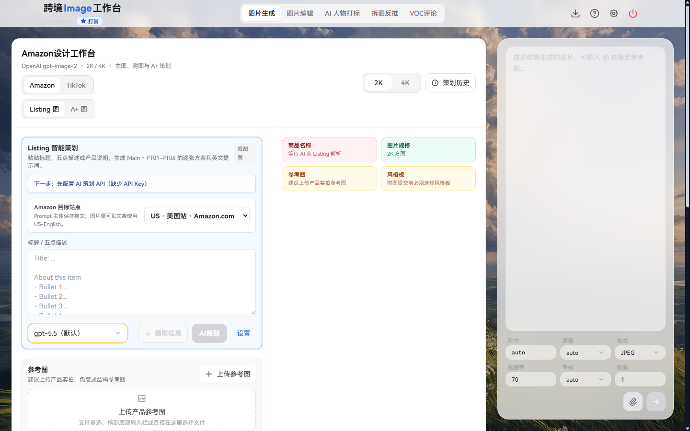

<!-- markdownlint-disable MD013 MD033 MD041 -->

<p align="center">
  
</p>

<h1 align="center">跨境Image工作台</h1>

<p align="center">
  面向 Amazon 与 TikTok Shop 的本地优先 AI 商品图片生产工作台。<br />
  从 Listing 图片策划和风格板，到批量生成、编辑、复盘与交付，在一个界面完成。
</p>

<p align="center">
  <a href="https://github.com/china-luo/ImageStudioRemasteredVersion/actions/workflows/ci.yml"></a>
  <a href="https://github.com/china-luo/ImageStudioRemasteredVersion/releases/latest"></a>
  <a href="./LICENSE"></a>
  
  
</p>

<p align="center">
  <a href="https://china-luo.github.io/ImageStudioRemasteredVersion/">在线体验</a>
  · <a href="https://github.com/china-luo/ImageStudioRemasteredVersion/releases/latest">下载 Windows 版</a>
  · <a href="https://github.com/china-luo/ImageStudioRemasteredVersion/issues">反馈问题</a>
</p>



## 为什么使用它

跨境Image工作台不是单一的“输入 Prompt、等待图片”页面。它把电商图片生产拆成可检查、可停止、可恢复的步骤，让商品事实、平台规范、视觉风格和最终交付保持在同一条工作流中。

- **面向真实电商流程**：覆盖 Amazon Listing、Amazon A+、TikTok Shop 主图与详情图。
- **先策划再生产**：一次生成商品信息摘要、逐张方案和动态风格候选，再批量生图。
- **商品事实优先**：标题、五点描述和参考图共同约束材质、颜色、配件、卖点与禁用元素。
- **多模型、多服务商**：文本策划和图片生成使用独立配置，按工作流选择合适模型。
- **本地优先**：任务、图片和策划历史保存在本地；桌面版凭据使用系统加密存储。
- **接近交付而非演示**：支持筛选、收藏、复用、批量选择、编号命名和 ZIP 打包。

## 完整图片生产流程

```text
标题 / 五点描述 + 产品参考图
                ↓
   AI 解析商品信息并完成逐张图片策划
                ↓
    3 组动态风格候选与风格板
                ↓
      单图校对 / Prompt 微调
                ↓
          批量提交图片生成
                ↓
       编辑、筛选、ZIP 交付
```

1. 粘贴标题、五点描述或产品说明，并上传产品实拍、包装或结构参考图。
2. 使用“AI策划”一次生成只读商品信息摘要、完整图片位方案、中文策划说明和英文生图提示词。
3. 根据本次商品和市场信息生成 3 个动态风格方向，并选择风格板保持系列一致性。
4. 逐张检查或编辑提示词，也可以勾选多个图片位批量生成。
5. 在历史记录中复用、收藏和筛选结果，最终按顺序打包为 ZIP 下载。

AI 请求支持阶段状态、停止和超时控制。请求进行期间会锁定标题、站点、模型及参考图等输入，页面切换后任务和工作区状态仍可继续管理。

## 核心功能

| 工作区 | 能力 |
| --- | --- |
| **图片生成** | 最多 16 张产品参考图、`@图` 精确引用、尺寸/质量/格式参数、任务重试、结果复用与二次编辑 |
| **Amazon Listing** | US、JP、DE、FR、IT、ES 站点；固定规划 `MAIN + PT01-PT06` 7 个图片位；站点语言和可见文案约束 |
| **Amazon A+** | 普通、标准、高级和移动端 A+ 模块编排；模块尺寸、文案方向、提示词与批量生成 |
| **TikTok Shop** | 美国站商品主图 6 图方案、移动端详情图 8 图方案，以及对应的平台内容约束 |
| **动态风格系统** | 基于商品资料生成 3 个风格候选和系列风格说明；Amazon MAIN 主图保持白底规则，附图/A+/TikTok 使用选定风格板 |
| **图片编辑** | 支持首页生图模型与 Seedream Pro 编辑引擎；画布缩放、拖动、区域标注、撤销/重做和连续编辑 |
| **拆图反推** | 结合竞品图、自家商品资料和 SOP，输出中文拆解、迁移方案、英文 image prompt 与 negative prompt |
| **VOC 评论** | 通过 Shulex OpenAPI 按 ASIN 获取评论，或导入 CSV/XLSX；生成痛点、卖点、Listing、A+ 和图片策略报告 |
| **AI 人物打标** | 为已确认需要披露的图片或视频写入 Amazon 要求的 XMP 标记，支持单文件和 ZIP 批量交付；不会识别人脸，也不会上传媒体 |
| **历史与交付** | 搜索、来源/状态/形状筛选、收藏、批量删除、批量下载；Web 端生成带清单的 ZIP，桌面端可选择目录保存多张图片 |

## 快速开始

### 在线体验

访问 [GitHub Pages 在线版](https://china-luo.github.io/ImageStudioRemasteredVersion/)。

在线版是纯静态应用，浏览器会直接请求你配置的 API。上游接口必须允许浏览器跨域（CORS）；如果出现 `Failed to fetch`，建议使用 Windows 桌面版、本地开发代理或自行部署同源代理。

### Windows 桌面版

从 [Releases](https://github.com/china-luo/ImageStudioRemasteredVersion/releases/latest) 下载最新的 x64 安装包。桌面版通过受控的 Electron 主进程请求 API，更适合日常生产和需要规避浏览器跨域限制的场景。

### 从源码运行

要求：Node.js 20 或更高版本，推荐使用 CI 同款 Node.js 24。

```bash
git clone https://github.com/china-luo/ImageStudioRemasteredVersion.git
cd ImageStudioRemasteredVersion
npm install
npm run dev
```

打开 `http://127.0.0.1:5173/`。Windows 用户也可以直接运行 `start-amazon-image-studio.bat`，脚本会检查依赖并启动本地服务。

生产构建与桌面预览：

```bash
npm run build
npm run preview
npm run desktop
```

### Docker

本地构建静态 Web 镜像：

```bash
docker build -f deploy/Dockerfile -t amazon-image-studio .
docker run --rm -p 8080:80 amazon-image-studio
```

打开 `http://localhost:8080/`。默认镜像不启用 API 代理；代理环境变量和部署边界见 [部署文档](./docs/deployment.md)。

## API 配置

首次使用时，打开右上角 **设置 → API 配置**。建议至少建立两个配置：

| 用途 | API 模式 | 说明 |
| --- | --- | --- |
| 图片生成 | Images API / 支持图片输出的 Chat Completions | 用于首页生图、风格板和最终商品图 |
| AI 策划 | Responses API / Chat Completions | 用于生成商品信息摘要和 Listing/A+/TikTok 策划 |
| 拆图反推 | Responses API / Chat Completions | 可与策划共用，也可以独立配置 |
| VOC 分析 | Responses API / Chat Completions | 评论数据分析；ASIN 抓取另需 Shulex OpenAPI Key |

内置支持：

- OpenAI 及 OpenAI-compatible API
- OpenRouter 图片模型
- fal.ai
- 火山方舟 Seedream
- 可导入的自定义图片服务商配置

API Key 不会提交到本仓库。Web 版将 Key 保存在当前标签页的 `sessionStorage`；Windows 桌面版使用系统加密凭据存储。调用费用由你配置的服务商直接计费。

## 数据与隐私

- 任务、图片缓存、工作区草稿和策划历史主要保存在浏览器 IndexedDB 中。
- SOP 与 VOC 草稿在切换页面后保留；正在执行的任务由共享任务队列继续管理。
- AI 人物打标完全在本地写入元数据，不上传媒体，也不负责判断图片中是否存在 AI 人物。
- 图片生成、策划、拆图和 VOC AI 分析会把你主动提交的文本/图片发送到所选 API 服务商。
- 使用浏览器清理站点数据会删除本地记录；可在设置中使用数据导入/导出功能进行迁移或备份。

## 开发

```bash
npm run typecheck          # TypeScript 检查
npm run lint               # ESLint
npm run format:check       # Prettier 检查
npm run test               # Vitest 单元测试
npm run test:e2e           # Playwright 端到端测试
npm run test:electron      # Electron IPC 测试
npm run build              # 生产构建
```

构建 Windows 安装包：

```powershell
npm run build:installer
```

安装包版本、命名、NSIS 前置工具和验证命令见 [Windows 打包文档](./docs/packaging.md)。

## 技术栈

- React 19 + TypeScript + Vite
- Tailwind CSS
- Zustand
- IndexedDB
- Electron + NSIS
- Vitest + Playwright
- Cloudflare Pages / GitHub Pages / Docker 静态部署

## 项目文档

- [部署与 API 请求策略](./docs/deployment.md)
- [Windows 安装包](./docs/packaging.md)
- [Amazon 图片规范与附图策划逻辑](./docs/knowledge/亚马逊图片规范与附图策划逻辑.md)
- [TikTok Shop 美国站商品图规范](./docs/knowledge/TikTok%20Shop%20美国站商品主图与详情图规范.md)
- [更新日志](./CHANGELOG.md)

## 参与贡献

欢迎提交 Issue 和 Pull Request。提交代码前请至少运行：

```bash
npm run typecheck
npm run lint
npm run test
npm run build
```

## License

[MIT](./LICENSE) © [china-luo](https://github.com/china-luo)
